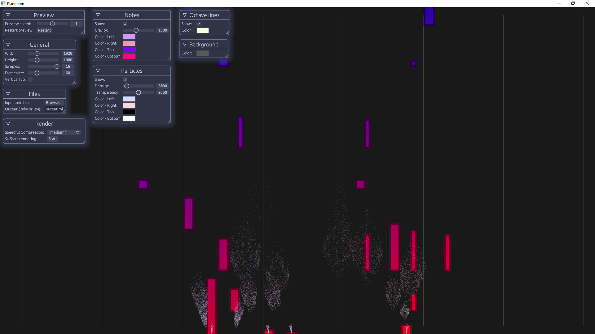

# Pianorium

  

A cross-platform midi visualizing app for piano videos.  
100% free, open-source, no-watermark, forever!  
Still in development.

This software only aims to provide the *computer graphics* part of piano videos.  
Thus you can choose the DAW & video editor you want to create & customize the audio and the final video.  
I would recommend [LMMS](https://lmms.io/) DAW and [Shotcut](https://shotcut.org/) video editor.

## Installing
You have two ways of installing this software: downloading prebuilt versions (fastest on Windows and Linux) and compiling from source (universal, but a bit longer).

Without compiling (MacOS unavailable): 
- This is your first time installing: 
    - Windows: Head to [Releases](https://github.com/Coddeus/Pianorium/releases), download  pianorium-3.0.exe and libraries-dll.zip, unzip libraries-dll.zip, and put all the .dll next to pianorium-3.0.exe. Run pianorium-3.0.exe.
    - Linux: Install ffmpeg dynamic libraries from your package manager, download pianorium-3.0 from [Releases](https://github.com/Coddeus/Pianorium/releases). You might need to install gl and file dialog package, e.g. on Ubuntu `sudo apt-get install ffmpeg kdialog mesa-utils`. Run pianorium-3.0.
- You already have installed a version of this software (or already have ffmpeg libraries installed):
    - Windows: In [Releases](https://github.com/Coddeus/Pianorium/releases), download pianorium-3.0.exe. Move the .dll installed with an earlier version next to pianorium-3.0.exe (the new one). Run it.
    - Linux: In [Releases](https://github.com/Coddeus/Pianorium/releases), download pianorium-3.0. Run it.

Compiling from source (supported everywhere):
- Install [Git](https://git-scm.com/downloads)
- Install [Rust](https://www.rust-lang.org/tools/install)
- In a terminal, `git clone https://github.com/Coddeus/Pianorium.git`
- Download ffmpeg dynamic libraries for your system. You have two options:  
    1. [Harder, way longer] Compile ffmpeg from [source](https://ffmpeg.org/releases/ffmpeg-6.0.tar.xz), enabling shared libraries, libx264, and the (default) AV* and SW* components, or
    2. [Easier] Download prebuilt versions of ffmpeg libraries, depending on your platform:  
        - Windows: [From gyan.dev](https://www.gyan.dev/ffmpeg/builds/ffmpeg-release-full-shared.7z)
        - MacOS: [Brew](https://formulae.brew.sh/formula/ffmpeg) ffmpeg libraries. (`brew install pkg-config ffmpeg`)
        - Linux: Install ffmpeg libraries with your package manager. [Ubuntu](https://launchpad.net/ubuntu/+source/ffmpeg), [Debian](https://tracker.debian.org/pkg/ffmpeg), [Fedora/Red Hat enterprise](https://rpmfusion.org/)

## Using

Once you run Pianorium, it will prompt you to choose the .mid file you want to convert to a video. You can always change it within the app.

Then choose each available parameter inside the real-time preview. This is documented in [the book](https://coddeus.github.io/Pianorium/).

Click "`✨ Start rendering!`"  or close the window, to start the rendering. 

It will automatically stop when finished, and closing the window before that will only render a portion of the video.

## Contributing
Found a bug, have a feature/enhancement idea? Github issues are welcome to help the development of this project!

To build the codebase locally, you will need: 
- this repository to be cloned,
- [Rust installed](https://www.rust-lang.org/tools/install),
- [[guide]](https://github.com/zmwangx/rust-ffmpeg/wiki/Notes-on-building) FFmpeg installed to be dynamically linked with the generated binary,
- [[guide]](https://github.com/Rust-SDL2/rust-sdl2) SDL2 installed to be statically linked with the sdl2 crate,

`cargo run` or start a degugging session to check everything is fine, and start developing!

## Credits
If you use this software (e.g. for videos), please consider crediting to it. For example:  
Midi visualization software: Pianorium by Coddeus on GitHub

This is not required but really appreciated ^^.

## Program License

GNU GPL v3, see [LICENSE](LICENSE).
