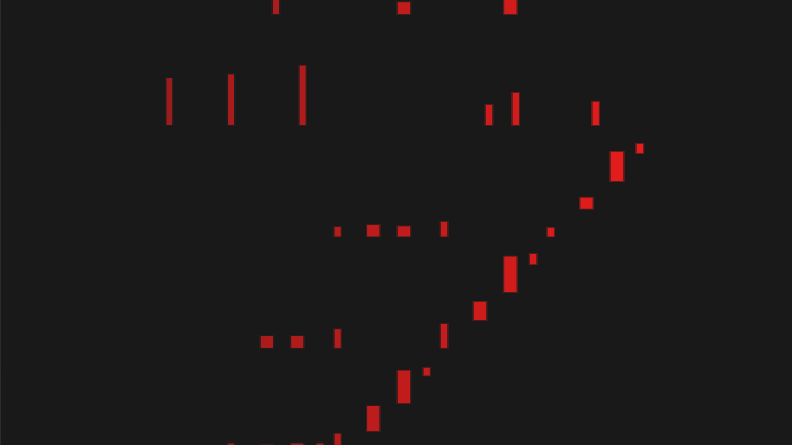

# Pianorium

  
A cross-platform midi visualizing app for piano videos.  
Still in development.

This software only aims to provide the *computer graphics* part of piano videos.  
Thus you can choose the DAW / video editor you want to create the final video.

## Prerequisite

[FFmpeg executable](https://ffmpeg.org/download.html) on the system path.  
Enough space in memory for the video you want to render.

## Rendering

CLI command syntax:

```bash
pianorium width height framerate samples midi_path output_path clear_directory
```

With:

| Keyword         | Type   | Description                                                                                                | Example                                       |
| --------------- | ------ | ---------------------------------------------------------------------------------------------------------- | --------------------------------------------- |
| width           | usize  | The width of the render in pixels.                                                                         | 1920                                          |
| height          | usize  | The height of the render in pixels.                                                                        | 1080                                          |
| framerate       | f32    | The number of frames per second.                                                                           | 60.0                                          |
| samples         | u8     | The number of samples per pixel. A higher value will produce a smoother render, but less fast.             | 11                                            |
| midi_path       | String | The path to your midi file, including the extension.                                                       | ./songs/monlitesonata.mid                     |
| output_path     | String | The path where to save the render, including the extension (mp4).                                          | ./renders/Beethoven-Moonlight_Sonata_Mvt1.mp4 |
| clear_directory | bool   | Whether or not to clear the temporary files once the render finishes, true (generally) or false (to debug) | true                                          |

- You need to specify all fields in the command.
- Paths are specified (with a "." in the beginning) from the directory you run the executable from, which isn't necessarily where the executable is located.  
- It is preferable that the midi file contains a single track (Several tracks could cause bugs with other data which wouldn't be piano notes)


## Features
- Choose the above parameters,
- The render can be bigger than the size of your screen,
- 100% free, open-source, no-watermark, and forever!

## Credits
If you use this software or find it cool, consider crediting to it 😊.  

## Program License

GNU GPL v3, see [LICENSE](LICENSE).
