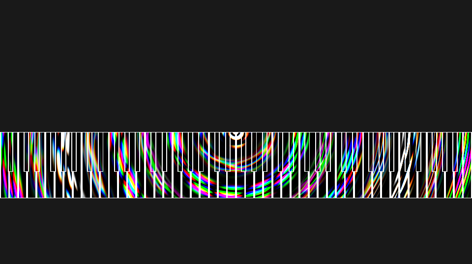

# Pianorium
  
A free and open-source midi visualizing tool, powered by OpenGL.

## Prerequisite
FFmpeg on the system path.  
Enough space in memory for the video you want to create.

## What it should become
Input a midi file or connect a cable, and get a resulting beautiful animation, like those Youtube piano videos, rendering (or not) on your screen while efficiently exporting as an mp4 video.

## License
GNU GPL v3, see [LICENSE](LICENSE).
